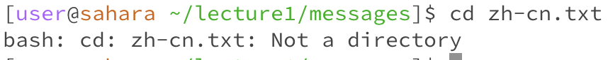
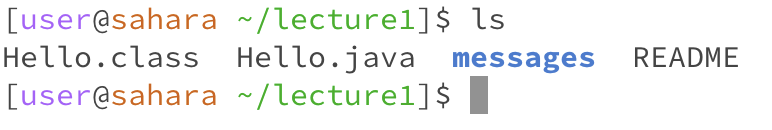
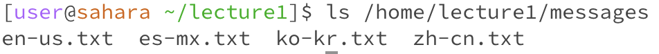

# CSE 15L Lab 1

## cd Command
1. **cd with no arguments**
    
   
    
   The directory I was in was /home/lecture1. Running the cd command with no arguments appears to just have brought me back to the home directory, at /home. cd means to "change directory", so having no arguments would just bring you to the home directory. There is no output, because you are just changing the directory.
2. **cd with path to directory as argument**
    
   
    
   The directory I was in was /home. Running "cd /home/lecture1/messages/ brought me to the messages directory, which has lecture1 as its parent directory. Using cd with a path to a directory as an argument will take you to that directory, and again there is no output because you are just changing your location in the file structure.
3. **cd with path to file as argument**
    
   
    
   I was in the messages directory, and tried to cd into "zh-cn.txt", and got an output of "bash: cd: zh-cn.txt: Not a directory". This makes sense because cd means to change directory, not to change to a file, so attempting to change to something that is not a directory will produce a similar output. This output is an error because the expected use of cd is to change to a directory and this was not a proper use of cd.

## ls Command
1. **ls with no arguments**
    
   
    
   I was in the lecture1 directory, and just ran the command "ls". The output I got was a list of all the files and directories that had the parent directory of "lecture1", which in this case was Hello.class, Hello.java, messages, and README. The function of ls is to list all files in the current directory, so this output was expected and therefore not an error because all 4 of those files are subdirectories or files of lecture1.
2. **ls with path to directory as argument**
    
   
    
   I ran the command "ls /home/lecture1/messages". The output I got was a list of all the files in the messages and directory. By supplying a path to a directory as an argument, we are basically asking to list all the files in that directory path, which is the function of ls, and therefore this output is not an error because it outputted all the files of messages as required.
3. **ls with path to file as argument**
    
   
    
   I ran the command "ls /home/lecture1/Hello.java". The output I got was "Hello.java". This makes sense because what you're asking to do is list all the files in "Hello.java", but since that itself is a file, it is just listing the file name itself. This is not an error because ls is still functioning as normal.
## cat Command
1. **cat with no arguments**
    
   
    
   Running the cat command with no arguments just made it so that I could make inputs with my keyboard, although I don't think those inputs were stored anywhere, and exited only when I gave it an end-of-file signal of Ctrl C. The cat command is used to display the content of the file or concatenate files, but leaving no arguments leaves no file to display, so I would say that this is an error because the cat command should be supplied with arguments.
2. **cat with path to directory as argument**
    
   
    
   I ran the command "cat messages" in the lecture1 directory. It gave me an output of "cat: messages/: Is a directory". I got this output because cat is meant to be used to display the contents of a file, not a directory, and to display the contents of a directory you should use ls instead. I would say that this output is an error because we are trying to use a command thats meant for files on a directory, and the output explicitly told us that what we're trying to use the command on is a directory, and thus failed.
3. **cat with path to file as argument**
    
   
    
   I ran the command "cat README" in the lecture1 directory. The output was the contents of the README file, which makes sense because the most common use of cat is to display the contents of a file, which in this case is README, so the output is not an error.
